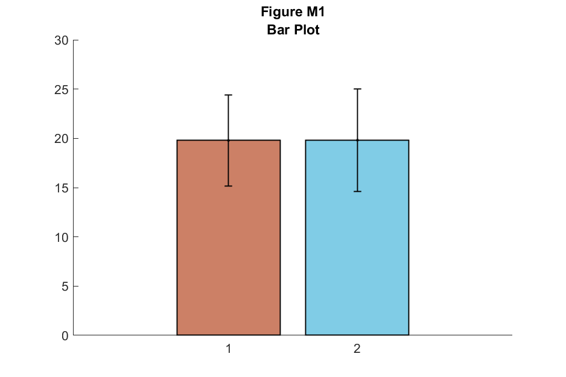
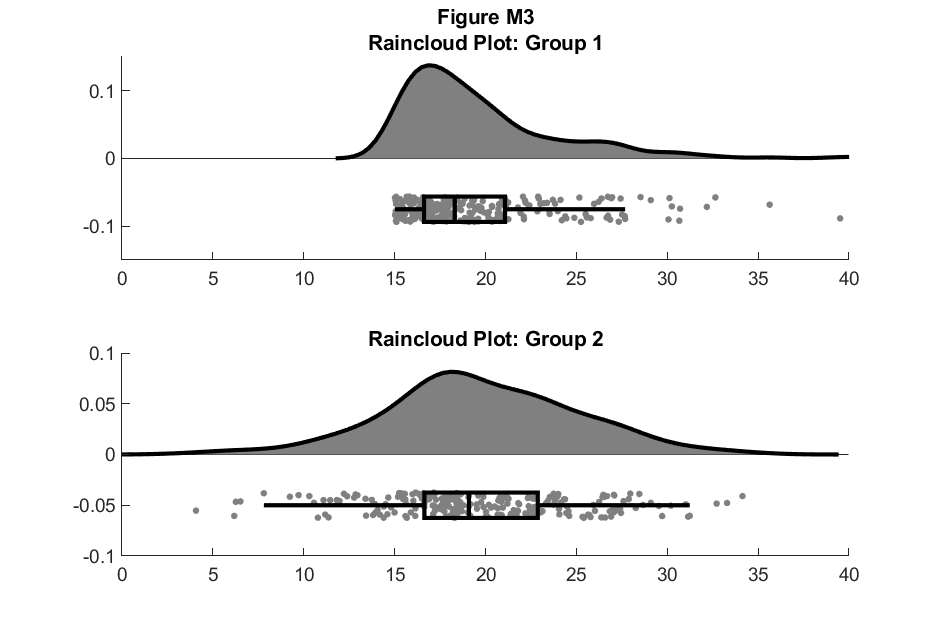
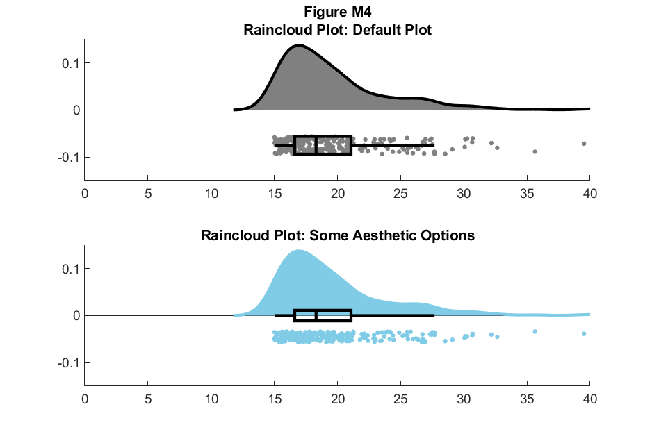
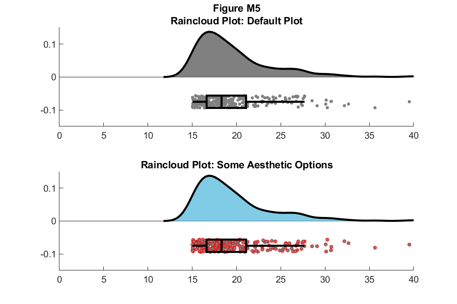
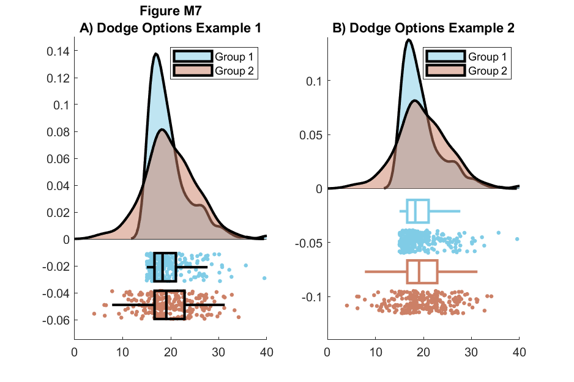
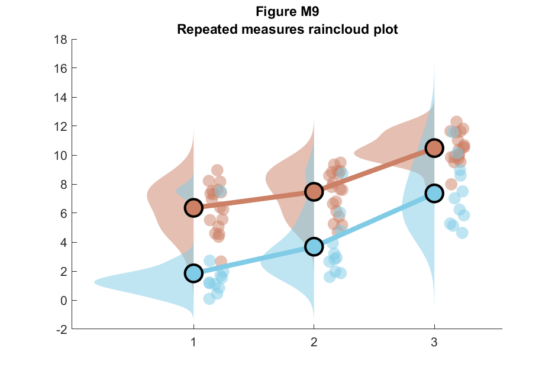
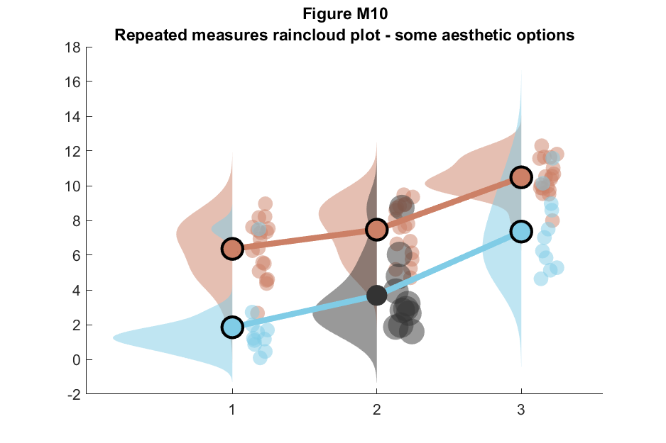

**CONTENTS:**
- [Disclaimer](#disclaimer)
- [Getting started](#getting-started)
  - [Examples](#examples)
    - [Simple plot with no options](#simple-plot-with-no-options)
    - [Box dodge & come color options](#box-dodge-come-color-options)
    - [More aestetic options](#more-aestetic-options)
    - [Overlay](#overlay)
    - [Repeated measurements](#repeated-measurements)
    - [Formatted repeated measurements](#formatted-repeated-measurements)
  - [Using this repository as a package](#using-this-repository-as-a-package)
- [Additional resources on Raincloud plots](#additional-resources-on-raincloud-plots)

------------------------------

# Disclaimer
This repository is derived a part of [Raincloud Plots repository][Origin] (which also contains Python and R implementations) to made it more useful in MATLAB as a package.

Original MIT-Licencing model remains unchanged. See [LICENCE](./LICENCE) for more details.

[Origin]:   https://github.com/RainCloudPlots/RainCloudPlots/commit/d5085be93a4bd835ce24d0205b23759c5e064f27

# Getting started
Take a look into [`Example.mlx`](./Example.mlx). Running this script will generate images above.
## Examples
All Examples are based on data distributed as follows:



### Simple plot with no options


### Box dodge & come color options


### More aestetic options


### Overlay


### Repeated measurements


### Formatted repeated measurements


## Using this repository as a package
Perform following steps to use this repository as a Package in your MATLAB Project:
1. Clone repository into some folder with preceding `+`, e.g.: `+raincloudPlot`
2. Call functions in MATLAB using preceding Package name:
   ```matlab
   raincloudPlot.raincloud_plot
   ```


# Additional resources on Raincloud plots
There are a couple resources, you may suggest useful for working with raincloud plots:
1.  [Original raincloud plot implementation by Tom Marshall](https://git.fmrib.ox.ac.uk/marshall/public/-/tree/master/raincloud_plots)
2.  [Paper on welcomeopenresearch](https://wellcomeopenresearch.org/articles/4-63/v2)
3.  [cbrewer color schemes](https://www.mathworks.com/matlabcentral/fileexchange/34087-cbrewer-colorbrewer-schemes-for-matlab)